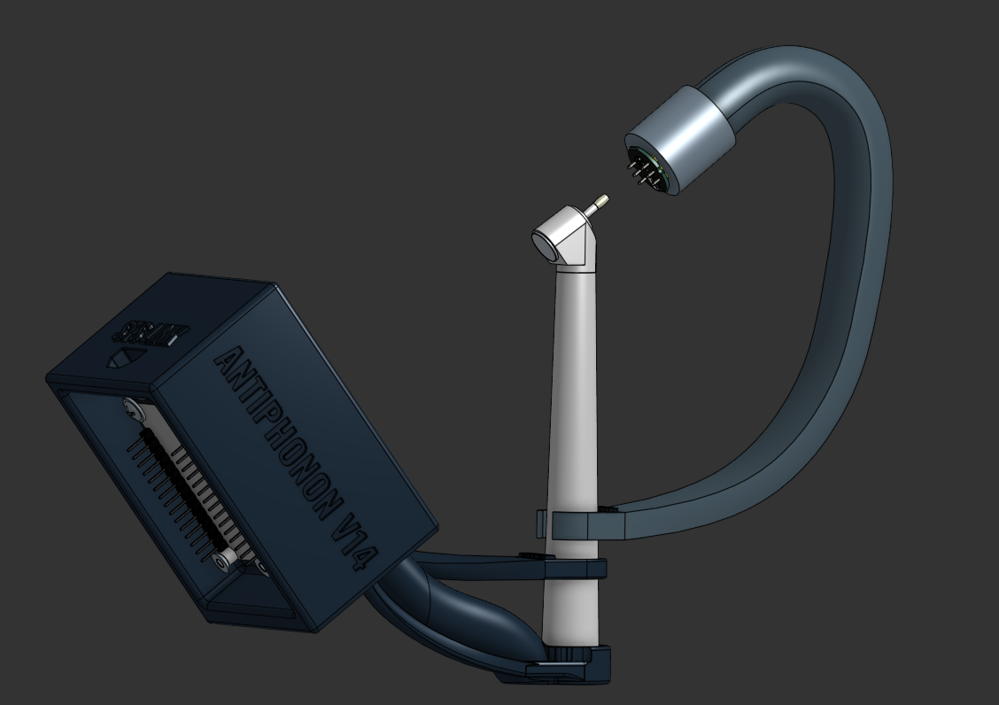

# ANTIPHONON, An Active Noise-Cancelling Apparatus for Dental Drills

#### Development started: October 2020
#### Version 14 Finished: August 2025
#### Repository finalized: October 2025

## Design Philosophy 

The system’s design merges acoustic engineering with real-time digital signal processing, using the Fast Fourier Transform (FFT)/Fourier analysis to isolate and invert the drill’s dominant frequency components for targeted phase-cancellation. Each iteration refined both the hardware geometry and spectral precision, transforming raw sound data into structured silence.

## Overview

#### ANTIPHONON is an active noise-cancelling system designed to reduce the high-pitched discomfort of dental drills. 

What began as a sixth-grade curiosity about how headphones cancel noise and the struggles my mom (a practicing dentist) and daily dental patients face evolved into a multi-year engineering effort that blends signal processing, hardware design, and iterative testing.

The goal was to develop a compact, patient-focused system capable of real-time phase inversion and multi-harmonic cancellation tuned to dental drill frequencies.

## Development Timeline

### Early Research and Hypothesis

- Initial Hypothesis: Utilize **the spacing of sound waves** to model the viability of deconstructive sound interference

- Version 0 Prototype: Arduino Uno in tandem with KY-083 sound sensor

- Hypothesis _validated_: Visualized interference via two speaker system and measured amplitude drops

### CAD Integration and Mechanical Design

- Transitioned from breadboards to precise CAD using OnShape and Autodesk Inventor

- Versions 1-4: Designed and printed structural housings to stabilize mic-speaker geometry (a "speaker front" approach to the challenge)

  

<em>Fig 1. Collage of original ANTIPHONON prototypes. Integration was a major focus of this iteration, which relied on an Arduino Nano for processing</em>

- Tests were **successful** -- supported the **closed loop system**

- Identified issues: weak PLA adhesion, internal angle misalignment, and vibration-based flexion

- Drove stronger, geometry-corrected Version 5 design

### Complete Redefinition of the Problem: Refinement and Iterative Prototyping

- Version 5: Solved **numerous** past issues with the design
  - Re-engineered the post-cancellation waveform geometry for improved phase coherence and spatial sound propagation
  
  - Redesigned the enclosure with a focus on manufacturability, acoustic isolation, and real-world usability, shifting from purely theoretical precision to a fully practical engineering implementation

  

<em>Fig 2. Parametric CAD render illustrating component geometry optimized for consistent microphone-speaker spacing while simultaneously allowing for practice day-to-day use</em>

- Versions 6-14: Incremental redesigns optimizing acoustic cavity geometry and electronics fit

- Upgraded from Arduino Uno to ESP32 for higher sampling rates and dual I²S support (much faster processing speeds)

- Developed targeted FFT to manage the multi-harmonic profile of drills

  

<em>Fig 3. Final printed build (Version 14) showing the compact ESP32 housing, acoustic sensor arm, and integrated microphone-speaker alignment (JST connectors) used for phase-corrected cancellation</em>

### Signal Processing and Active Cancellation

- Executed iterative phase-sweep calibration (from −π to π) to minimize measured amplitude at the target frequency

- Tuned the output loop to maintain phase alignment within ±3° around the ~7 kHz dominant drill tone

- Final testing graphs and recordings demonstrated up to 34 dB of active noise reduction under controlled conditions

## Author Information

Rohan Hablani || 
rohan.hablani@gmail.com || 
github.com/rohanH66
